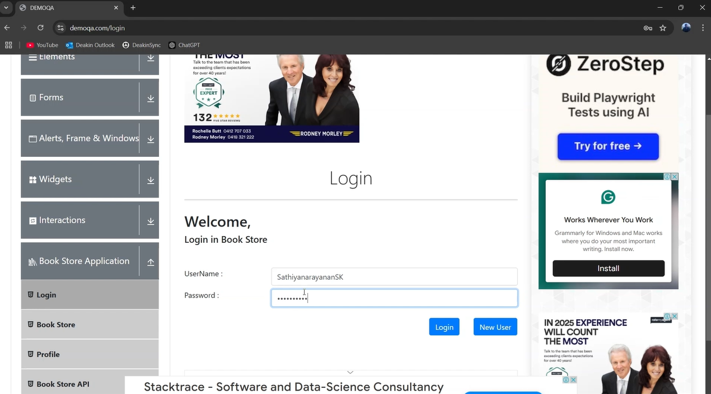
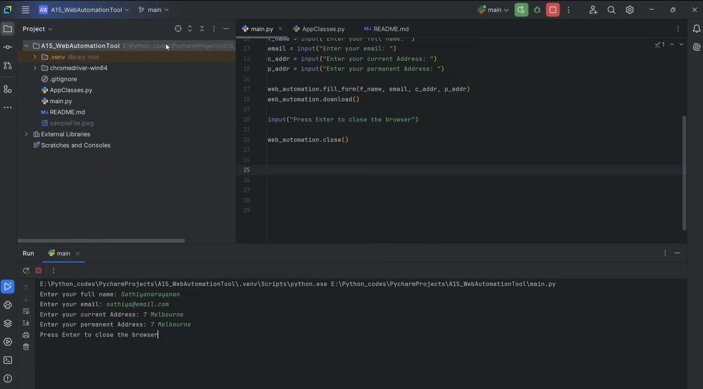

# 🚀 Web Automation Tool

A Python-based web automation tool built using **Selenium** to automate tasks like logging into websites, filling forms, and downloading files. This tool is designed to simplify repetitive web tasks and improve productivity.

---

## 🛠️ Features

- **Login Automation**: Automates user login on websites.
- **Form Filling**: Automates filling out web forms with user-provided data.
- **File Downloading**: Automates file downloads from web pages.
- **Customizable**: Easily extendable for additional web automation tasks.

---

## 🚦 How to Use

1. Install the required dependencies (`selenium`).
2. Download the ChromeDriver executable and place it in the `chromedriver-win64` folder.
3. Set up your environment variables (e.g., `PASSWORD_OLD` for login credentials).
4. Run the script and follow the prompts to input your details and automate the tasks.

---

## 📸 Screenshots

---

## 🎥 Demo

---

## 📬 Contact

Feel free to explore the project and share your feedback. For any inquiries, suggestions, or contributions, reach out to me at **sathiyanarayanan.s1698@gmail.com**.
